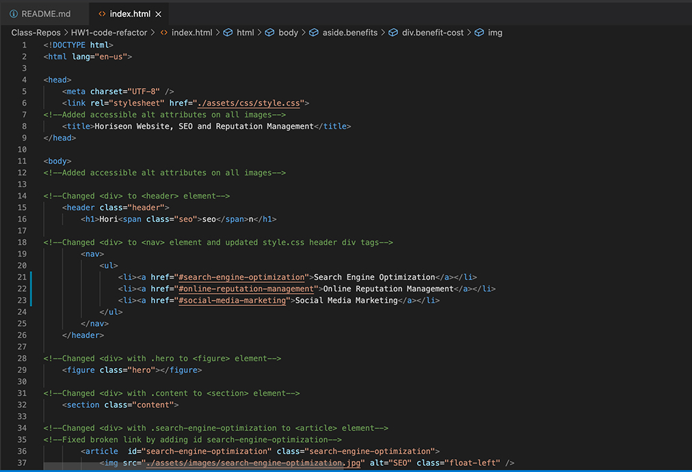

# code-refactor

In this repository, a given codebase is refactored to 
follow accessibility standards 
so that the site is optimized for search engines.

```
To meet the accessibility standards
    Converted Non-Semantic HTML elements into semantic elements
    HTML elements follow a logical structure independent of styling and positioning
    Added Accessible alt attributes to the image elements
    Heading attributes fall in sequential order
    Added a concise and descriptive title element
    Fixed Broken links
```




## Deployed Website : 
(https://banuakman.github.io/code-refactor/)
